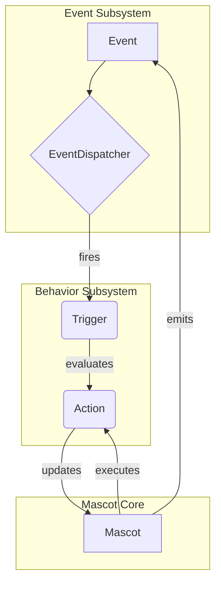

# Shimeji Neo — 全体アーキテクチャ

最終更新: 2026-01-04 (Asia/Tokyo)

この文書は、Shimeji Neo プロジェクトの全体アーキテクチャを定義します。

---

## 1. コアレイヤ

1) **Mascot（マスコット）**:
   - マスコット自身の状態（座標、実行中のアクション、環境変数）を保持する中心オブジェクト。
   - `EvaluationContext` の実体を提供する。

2) **Event サブシステム**:
   - `Event` (システムティック、状態変化など) が発生。
   - `EventDispatcher` がイベントを受け取り、関連する `Trigger` を評価する。
   - `EventWorkerPool` が非同期処理を担う。

3) **Behavior サブシステム**:
   - **Trigger**: 「いつ」行動を起こすかの条件 (`mascot.x > 100`)。
     - `TriggerCondition` がASTベースの式評価とキャッシュを担う。
   - **Action**: 「何を」するかという具体的な行動単位（歩く、ジャンプするなど）。
     - アニメーション再生、移動ロジック、状態変更を含む。
   - **Behavior**: `Trigger` と `Action` を結びつけるルール。

4) **Physics & Motion サブシステム**:
   - **Kinematic Corner Transition**: 壁と天井の境界など、物理演算だけでは不安定になる箇所を幾何学的な軌道計算 (`CornerMath`) で補間する。
   - **Hybrid Physics**: 通常時は重力と当たり判定に従うが、遷移アクション中は物理演算を一時的に無効化 (`ignoreWalls`) し、計算された軌道に従う。
   - **Environment Sensing**: `Environment` クラスにより、ウィンドウ位置やデスクトップ領域を論理座標系で正規化して提供する。

## 2. 近代化戦略 (Modernization Strategy)

技術監査に基づき、以下の技術スタックへの移行を推進する。

1) **GUIレイヤ (View)**:
   - **Current**: Swing / AWT (Java 2D)
   - **Target**: **JetBrains Compose Multiplatform** (Skia)
   - **目的**: 高DPI対応、宣言的UIによる状態管理の簡素化、レンダリングパフォーマンスの向上。

2) **ネイティブ連携 (Native Interface)**:
   - **Current**: JNA (Java Native Access)
   - **Current Status**: **Hybrid (JNA + Project Panama)**。パフォーマンスクリティカルなウィンドウ移動には Panama を採用済み。
   - **Target**: **Project Panama** への完全移行。
   - **目的**: 型安全性・メモリ安全性の確保、JIT最適化による呼び出しオーバーヘッドの削減。

3) **並行処理 (Concurrency)**:
   - **Current**: Platform Threads
   - **Target**: **Virtual Threads (Project Loom)**
   - **目的**: マスコット個体数増加時のリソース消費抑制とスループット向上。

## 4. セキュリティ設計 (Security Architecture)

外部リソース（マスコットデータ、設定ファイル）を取り扱う際のセキュリティ基準を定義する。

1) **XML処理 (XXE対策)**:
   - 全てのXMLパーサー (`DocumentBuilder`, `SAXParser`) において、DTD宣言と外部エンティティ参照を明示的に無効化する。
   - これにより、悪意あるXMLによるローカルファイル漏洩やDoS攻撃を防止する。

2) **アーカイブ展開 (Zip Slip対策)**:
   - マスコットデータのZIP展開時、エントリのパスを検証し、展開先ディレクトリ外への書き込み（パストラバーサル）をブロックする。
   - 実装詳細は `SECURITY_IMPLEMENTATION_GUIDE.md` を参照のこと。

## 3. データフロー

