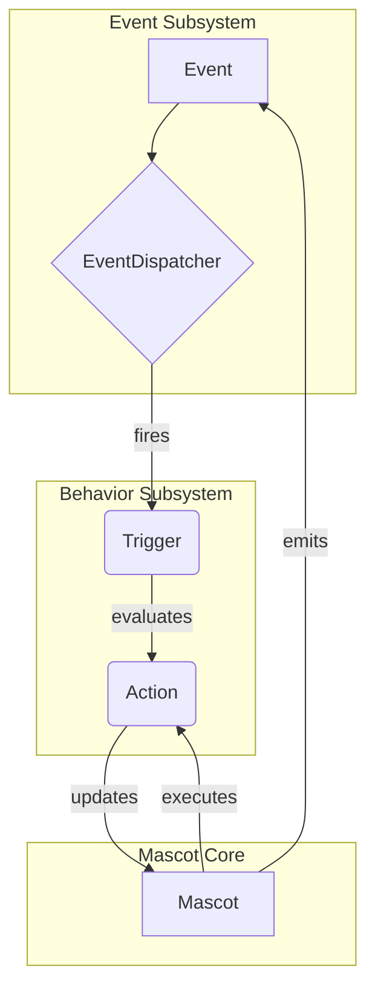

# Shimeji Neo — 全体アーキテクチャ

最終更新: 2025-12-08 (Asia/Tokyo)

この文書は、Shimeji Neo プロジェクトの全体アーキテクチャを定義します。

---

## 1. コアレイヤ

1) **Mascot（マスコット）**:
   - マスコット自身の状態（座標、実行中のアクション、環境変数）を保持する中心オブジェクト。
   - `EvaluationContext` の実体を提供する。

2) **Event サブシステム**:
   - `Event` (システムティック、状態変化など) が発生。
   - `EventDispatcher` がイベントを受け取り、関連する `Trigger` を評価する。
   - `EventWorkerPool` が非同期処理を担う。

3) **Behavior サブシステム**:
   - **Trigger**: 「いつ」行動を起こすかの条件 (`mascot.x > 100`)。
     - `TriggerCondition` がASTベースの式評価とキャッシュを担う。
   - **Action**: 「何を」するかという具体的な行動単位（歩く、ジャンプするなど）。
     - アニメーション再生、移動ロジック、状態変更を含む。
   - **Behavior**: `Trigger` と `Action` を結びつけるルール。

## 2. データフロー

